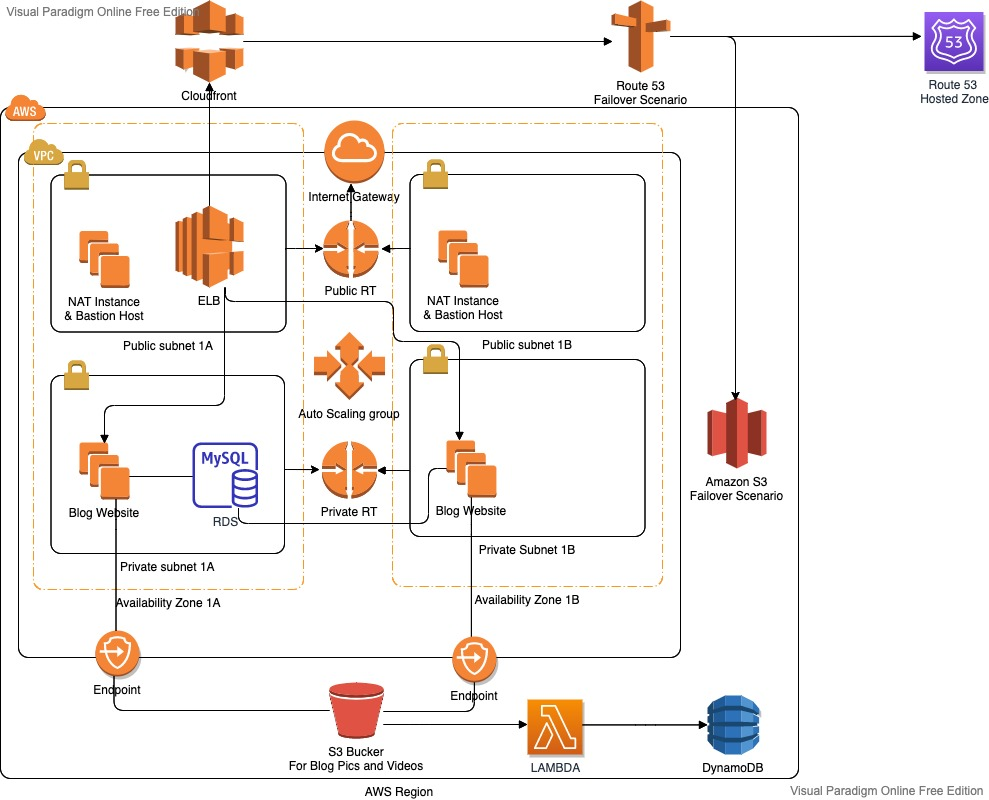

# aws-django-blog-asg

A Django blog on a multi-AZ AWS architecture: an Auto Scaling group behind an
Application Load Balancer, MySQL on RDS in private subnets, media in S3, and a
Lambda function that indexes every upload into DynamoDB.

## Architecture

| Layer | Implementation |
| --- | --- |
| Network | VPC across two availability zones, public and private subnet in each, internet gateway and NAT for private egress |
| Compute | EC2 instances from a launch template in an Auto Scaling group, behind an internet-facing ALB |
| Data | MySQL on RDS in the private subnets; uploads in S3 |
| Events | S3 `PutObject` triggers `lambda_function.py`, which writes the object key and timestamp to DynamoDB |
| Edge | CloudFront and Route 53 in front of the ALB, with an S3 failover page |

## Stack

Python 3.7 · Django 3.1 · AWS VPC, ALB, Auto Scaling, EC2, RDS, S3, Lambda,
DynamoDB, CloudFront, Route 53

## Design decisions

**Stateless web tier.** Uploads go to S3 and data to RDS, so any instance in the
Auto Scaling group can serve any request and instances can be replaced freely.

**Database off the public path.** RDS sits in the private subnets, reachable
only from inside the VPC.

**Indexing outside the request path.** Upload metadata is written by Lambda on
the S3 event, so a slow index never slows a page.

## Repository layout

| Path | Contents |
| --- | --- |
| `src/` | Django project (`cblog/` settings, `blog/` and `users/` apps, templates) |
| `lambda_function.py` | S3 to DynamoDB indexer |
| `userdata.sh` | Instance bootstrap: installs dependencies, runs migrations, starts the app |
| `S3_Static_Website/` | Failover page served from S3 |

## Configuration

Copy `src/.env.example` to `src/.env` and set `SECRET_KEY`, the database
`PASSWORD` and the RDS endpoint in `DB_HOST`. The file is gitignored.
